# Построение нейросетевого классификатора для идентификации типа подстилающей поверхности при движении мобильного робота в условиях неоднородной среды

### Цель работы:
- Приобретение практических навыков в решении одной из актуальных задач в построении
интеллектуальной СУ автономной робототехнической системы, функционирующей в условиях
физически неоднородной среды;
- Практическое изучение особенностей и способов решения задачи несбалансированной
классификации, а также расширение инструментария разработчика в части работы с методами
машинного обучения;
- Развитие исследовательских навыков работы с методом машинного обучения на примере
прикладной задачи и реальной выборке данных;
- Развитие навыков программирования систем вычислительного интеллекта на Python.

### Задача:
Построить нейросетевой классификатор (в соответствии с вариантом задания),
протестированный и более-менее устойчивый к новым данным (самостоятельно осуществить
проверку на выборке С), а также приобрести опыт и понимание работы нейросетевого алгоритма в
части влияния различных его параметров (числа слоев, нейронов в слое, числа итераций, функции
активации, способа предобработки данных и т.п.) на качество получаемой модели.

По варианту необходимо определять 5-ую поверхность.

## Данные

В данной работе исследуются данные, полученные с РТС Robotino в процессе движения по различным подстилающим поверхностям.
Для классификации подстилающей поверхности могут использоваться как непосредственные данные
измерений бортовой сенсорной системы (например, показания датчиков тока двигателей могут
служить информацией о трудоемкости перемещения по данной поверхности), так и интегральные величины.

Часть параметров для обучения получены непосредственно сенсорной системой робота:

  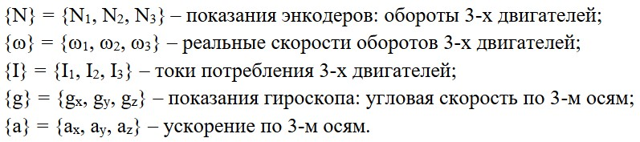

Еще часть параметров - рассчитывается:
- линейные скорости вдоль осей
- угловая скорость
- токи при линейном движении
- ток для совершения поворота
- суммарный ток

Их расчет осуществляется по следующим формулам:

  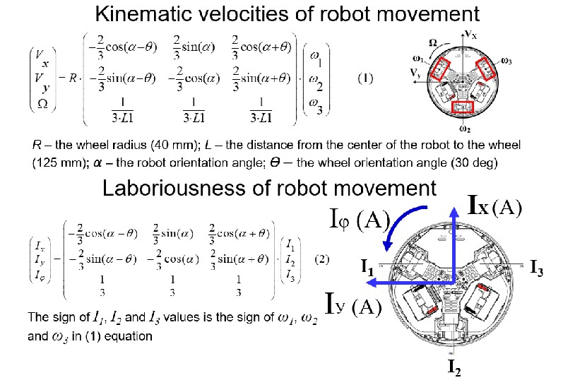

Расчет с помощью матриц был преобразован для расчета каждой величины отдельно:

  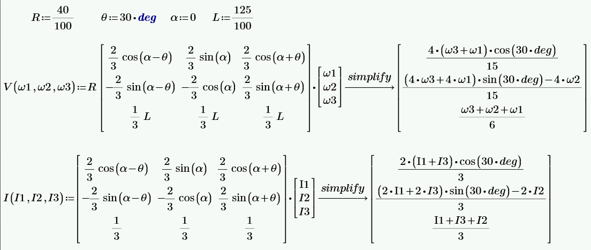

И последняя часть - множество относительных параметров, полученных путем математических
преобразований подмножеств:

  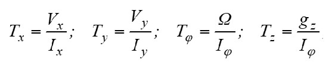

Параметры T показывают, какую скорость развивает робот в расчете на единицу потребляемого тока. Чем выше значение Tx, тем более энергоэффективно движение:
- Высокий Tx — робот развивает большую скорость при малом токе (легкое скольжение, низкое трение)
- Низкий Tx — для достижения той же скорости требуется больший ток (высокое сопротивление движению)

В данной работе параметры Tx, Ty, Tz используются как относительные признаки, характеризующие взаимодействие робота с подстилающей поверхностью.
Поскольку эти параметры нормированы (отношение величин), они менее зависят от абсолютных значений тока и скорости и лучше отражают именно свойства поверхности.
Это делает их ценными признаками для задачи классификации типа поверхности, в частности для идентификации поверхности типа 5.

## Последовательность исследования

В работе последовательно исследуется влияние следующих факторов на качество классификации:

- Архитектура нейронной сети — количество и размер скрытых слоев, функции активации, параметры регуляризации и оптимизации.
- Сортировка данных — сравнение стратифицированного перемешивания с использованием собственной функции и встроенных средств библиотеки.
- Нормализация данных — применение MinMaxScaler (приведение к диапазону [0,1]) и StandardScaler (стандартизация с нулевым средним и единичной дисперсией).
- Балансировка классов — использование методов синтетической генерации примеров меньшинства: ADASYN (адаптивный синтез) и SMOTE (синтез на основе ближайших соседей).

На каждом этапе проводится кросс-валидация, фиксируются лучшие гиперпараметры с помощью GridSearchCV, и выполняется проверка итоговой модели на независимой тестовой выборке C, не участвовавшей в процессе обучения.
Это позволяет объективно оценить реальную прогностическую способность полученных моделей.

## Структура нейронной сети MLP

Для решения поставленной задачи используется полносвязная нейронная сеть прямого распространения — MLP (Multilayer Perceptron) из библиотеки scikit-learn. 

На каждом этапе исследования для оценки качества модели используется 5-кратная стратифицированная кросс-валидация (StratifiedKFold). 

Для оценки качества модели используются две метрики:
- Accuracy (точность) — доля правильно классифицированных объектов. Однако для несбалансированных выборок высокая Accuracy может достигаться за счет преобладающего класса, даже если модель плохо распознает целевой класс.
- F1-score (F-мера) — гармоническое среднее между точностью (precision) и полнотой (recall). Эта метрика более информативна для несбалансированных выборок, так как она снижается, если модель плохо работает с целевым классом. В данной работе именно F1-score выбран в качестве основного критерия для выбора лучшей модели.

Для подбора оптимальных гиперпараметров модели использовался метод GridSearchCV из библиотеки scikit-learn, который осуществляет полный перебор всех возможных комбинаций гиперпараметров из заданной сетки с последующей оценкой качества каждой комбинации с помощью кросс-валидации. Перебор осуществлялся по следующим параметрам: 
- hidden_layer_sizes — архитектура скрытых слоев: (50, 25), (100, 50), (80, 40), (100, 50, 25), (80, 40, 20)
- activation — функция активации нейронов: relu, tanh, logistic
- solver — алгоритм оптимизации: adam
- alpha — параметр L2-регуляризации: 0.01, 0.03, 0.05

## Первый этап
Первым этапом было проведено обучение на данных, как они есть.
Подобраны следующие гиперапараметры по наилучшему F1-score:

Гиперпараметры:

| activation | alpha  | hidden_layer_sizes | solver |
|------------|--------|--------------------|--------|
| logistic   | 0.03   | (100, 50)          | adam   |

Значения метрик Accuracy и F1-score представлены в таблице ниже.

| Метрика   | Фолд 1 | Фолд 2  | Фолд 3  | Фолд 4 | Фолд 5  | Среднее   | Разброс      | Тест    |
|-----------|--------|---------|---------|--------|---------|-----------|--------------|---------|
| Accuracy  | 0.75   | 0.7714  | 0.8286  | 0.8    | 0.8286  | 0.7957    | (+/- 0.0312) | 0.8448  |
| F1-score  | 0.5714 | 0.5     | 0.25    | 0.3636 | 0.4     | 0.4170    | (+/- 0.1111) | 0.5714  |

  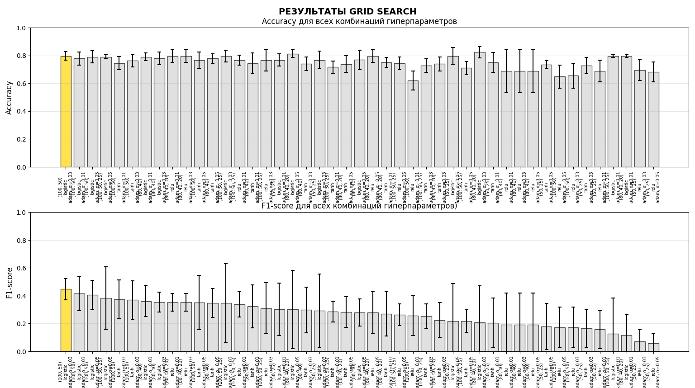

  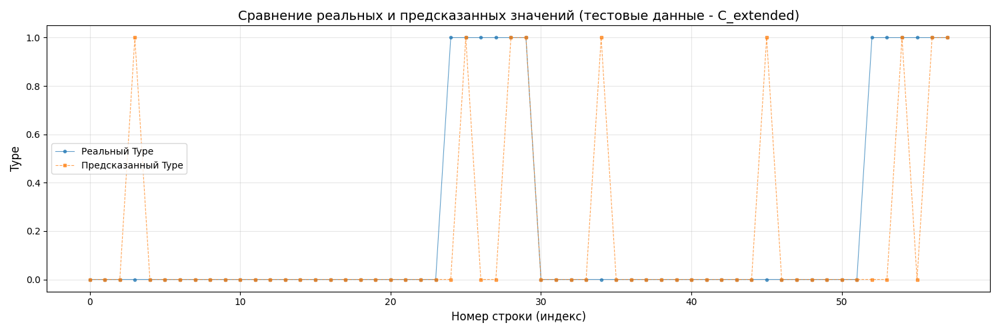

Перебор гиперпараметров позволил найти конфигурацию из выбранных гиперпараметров.
Двухслойная архитектура оказалась достаточной для данной задачи, усложнение сети не привело к значимому улучшению метрик.

## Второй этап: анализ сортированных данных

### Написание функции сортировки

После применения собственной функции стратифицированной сортировки лучшая модель имела параметры:

| activation | alpha | hidden_layer_sizes | solver |
|------------|-------|--------------------|--------|
| logistic   | 0.05  | (100, 50)          | adam   |

Значения метрик Accuracy и F1-score представлены в таблице ниже.

| Метрика   | Фолд 1  | Фолд 2   | Фолд 3   | Фолд 4  | Фолд 5   | Среднее   | Разброс      | Тест    |
|-----------|---------|----------|----------|---------|----------|-----------|--------------|---------|
| Accuracy  | 0.8611  | 0.8857   | 0.7143   | 0.7429  | 0.8857   | 0.8179    | (+/- 0.0741) | 0.8448  |
| F1-score  | 0.6154  | 0.75     | 0.375    | 0.1818  | 0.7143   | 0.5273    | (+/- 0.2167) | 0.6087  |

  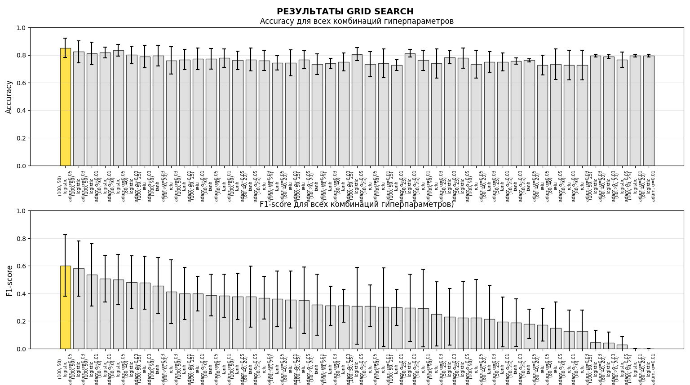

  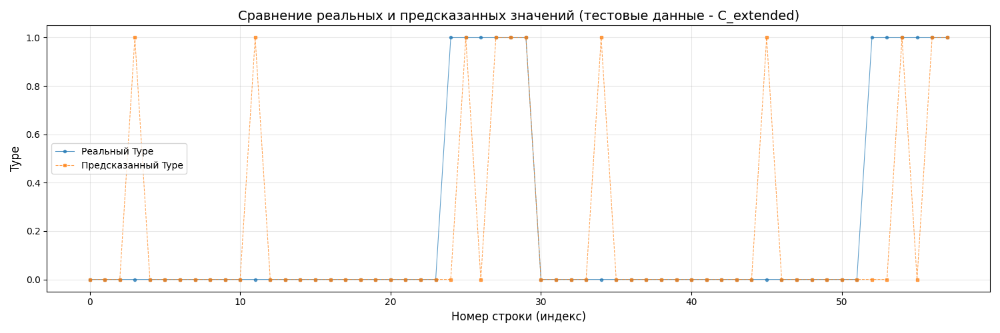

Сортировка данных с помощью собственной функции привела к улучшению F1-score на тестовой выборке с 57.14% до 60.87%.
Однако разброс метрик по фолдам увеличился, что указывает на неравномерное распределение целевого класса по фолдам после сортировки.
Функция стратифицированной сортировки корректно перемешивает данные с сохранением пропорций классов.

### Встроенная сортировка

При использовании встроенной стратифицированной кросс-валидации лучшая модель имела параметры:

| activation | alpha | hidden_layer_sizes | solver |
|------------|-------|--------------------|--------|
| logistic   | 0.01  | (100, 50)          | adam   |

Значения метрик Accuracy и F1-score представлены в таблице ниже.

| Метрика   | Фолд 1  | Фолд 2   | Фолд 3   | Фолд 4 | Фолд 5   | Среднее   | Разброс      | Тест    |
|-----------|---------|----------|----------|--------|----------|-----------|--------------|---------|
| Accuracy  | 0.8611  | 0.8571   | 0.7143   | 0.8    | 0.8571   | 0.8179    | (+/- 0.0566) | 0.8276  |
| F1-score  | 0.6667  | 0.6667   | 0.2857   | 0.4615 | 0.6154   | 0.5392    | (+/- 0.1474) | 0.5000  |

  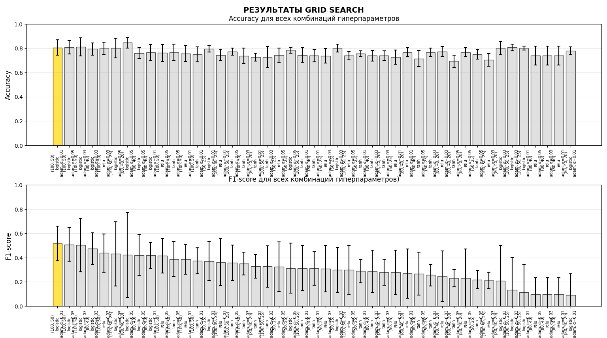

  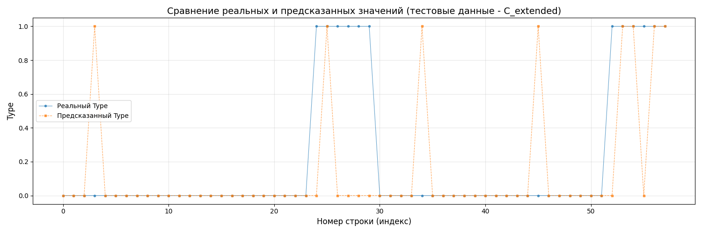

Встроенная стратификация в StratifiedKFold обеспечивает более стабильные результаты кросс-валидации (меньший разброс метрик), но показывает более низкий F1-score на тестовой выборке (50.00%) по сравнению с собственной функцией сортировки (60.87%).
Это может объясняться различным распределением сложных примеров между фолдами.
Рекомендуется использовать собственную функцию сортировки как более гибкий инструмент.
## Третий этап: анализ нормированных данных
### MinMaxScaler

MinMaxScaler — метод нормализации данных, который преобразует каждый признак путем масштабирования в заданный диапазон (по умолчанию [0, 1]).
Данный метод сохраняет форму исходного распределения и чувствителен к выбросам, поскольку экстремальные значения сжимают основной диапазон данных.

Применение MinMaxScaler для приведения всех признаков к диапазону [0, 1] значительно улучшило качество модели. Лучшая конфигурация:

| activation | alpha | hidden_layer_sizes | solver  |
|------------|-------|--------------------|---------|
| tanh       | 0.05  | (50, 25)           | adam    |

Значения метрик Accuracy и F1-score представлены в таблице ниже.

| Метрика   | Фолд 1  | Фолд 2   | Фолд 3   | Фолд 4   | Фолд 5    | Среднее   | Разброс      | Тест    |
|-----------|---------|----------|----------|----------|-----------|-----------|--------------|---------|
| Accuracy  | 0.9722  | 0.8571   | 0.8857   | 0.8857   | 0.8857    | 0.8973    | (+/- 0.0391) | 0.9138  |
| F1-score  | 0.9333  | 0.6667   | 0.7143   | 0.75     | 0.75      | 0.7629    | (+/- 0.0906) | 0.8148  |

  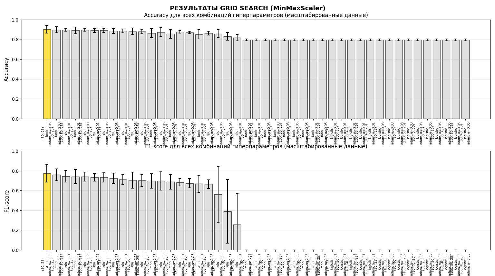

  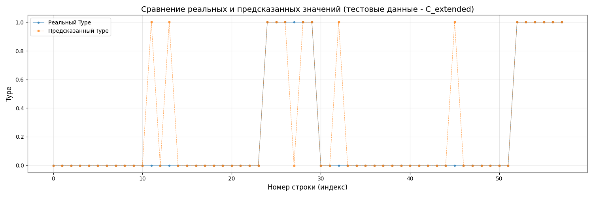

Нормализация данных MinMaxScaler кардинально улучшила качество классификации.
F1-score на тестовой выборке вырос с 57% до 81.48% (прирост более 40%). Модель стала значительно стабильнее — разброс F1-score по фолдам уменьшился с 11.11% до 9.06%. Функция активации tanh показала лучшие результаты на нормированных данных, что объясняется ее симметричностью относительно нуля. Уменьшение архитектуры до (50,25) указывает на то, что нормированные данные требуют меньшей емкости сети.

### StandardScaler

StandardScaler — метод стандартизации данных, который преобразует признаки так, чтобы они имели нулевое среднее и единичную дисперсию.
В отличие от MinMaxScaler, данный метод не ограничивает значения фиксированным диапазоном, но менее чувствителен к выбросам и приводит данные к распределению, близкому к нормальному.

Применение StandardScaler (стандартизация с нулевым средним и единичной дисперсией) дало следующие результаты:

| activation | alpha | hidden_layer_sizes | solver  |
|------------|-------|--------------------|---------|
| relu       | 0.01  | (80, 40, 20)       | adam    |

Значения метрик Accuracy и F1-score представлены в таблице ниже.

| Метрика   | Фолд 1 | Фолд 2   | Фолд 3 | Фолд 4     | Фолд 5    | Среднее   | Разброс      | Тест    |
|-----------|--------|----------|--------|------------|-----------|-----------|--------------|---------|
| Accuracy  | 0.9167 | 0.8571   | 0.9143 | 0.9143     | 0.8286    | 0.8862    | (+/- 0.0365) | 0.9310  |
| F1-score  | 0.8    | 0.7059   | 0.8    | 0.7692     | 0.625     | 0.7400    | (+/- 0.0670) | 0.8462  |

  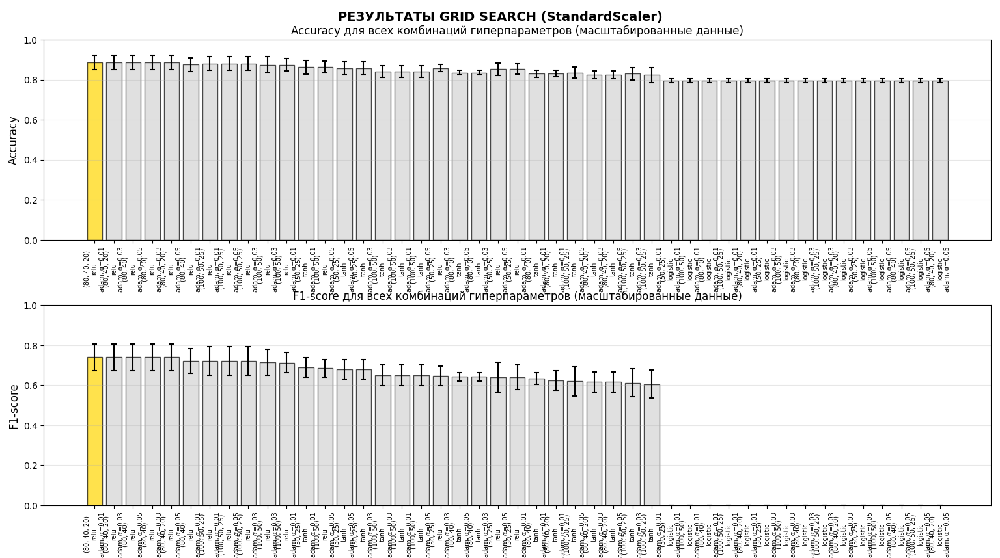

  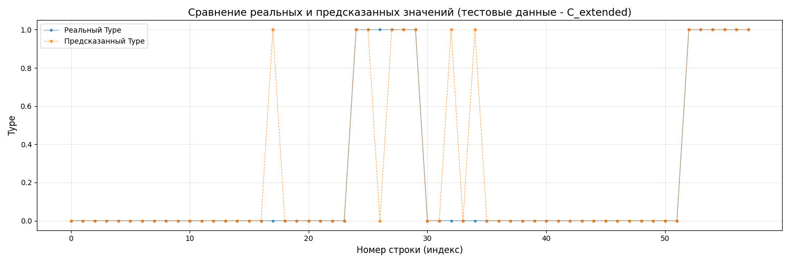

StandardScaler показал наилучший результат на тестовой выборке с F1-score 84.62%, что является максимальным значением среди всех экспериментов. Модель также характеризуется наименьшим разбросом метрик по фолдам (6.70% для F1-score). Интересно, что лучшая архитектура стала глубже — (80,40,20), а функция активации — relu. Это объясняется тем, что стандартизация приводит данные к распределению, близкому к нормальному, с которым relu работает эффективно. StandardScaler предпочтительнее MinMaxScaler для алгоритмов, чувствительных к выбросам.

## Четвертрый этап: анализ сбалансированных данных

### ADASYN (Adaptive Synthetic Sampling)

ADASYN — адаптивный метод синтетической балансировки классов, который генерирует новые примеры для класса меньшинства.
Основная идея заключается в том, что количество генерируемых синтетических примеров пропорционально сложности обучения для каждого образца меньшинства.
Чем сложнее классифицируется данный пример (т.е. чем больше примеров большинства вокруг него), тем больше синтетических образцов будет сгенерировано на его основе.
Это позволяет фокусироваться на «трудных» областях признакового пространства.

Проведена балансировка классов методом ADASYN. Лучшая модель:

| activation | alpha | hidden_layer_sizes | solver  |
|------------|-------|--------------------|---------|
| relu       | 0.01  | (100, 50, 25)      | adam    |

Значения метрик Accuracy и F1-score представлены в таблице ниже.

| Метрика   | Фолд 1   | Фолд 2   | Фолд 3  | Фолд 4  | Фолд 5   | Среднее   | Разброс      | Тест    |
|-----------|----------|----------|---------|---------|----------|-----------|--------------|---------|
| Accuracy  | 0.9825   | 0.9298   | 0.9474  | 0.9643  | 0.9286   | 0.9505    | (+/- 0.0206) | 0.9310  |
| F1-score  | 0.9831   | 0.9355   | 0.9508  | 0.9655  | 0.9333   | 0.9536    | (+/- 0.0187) | 0.8462  |

  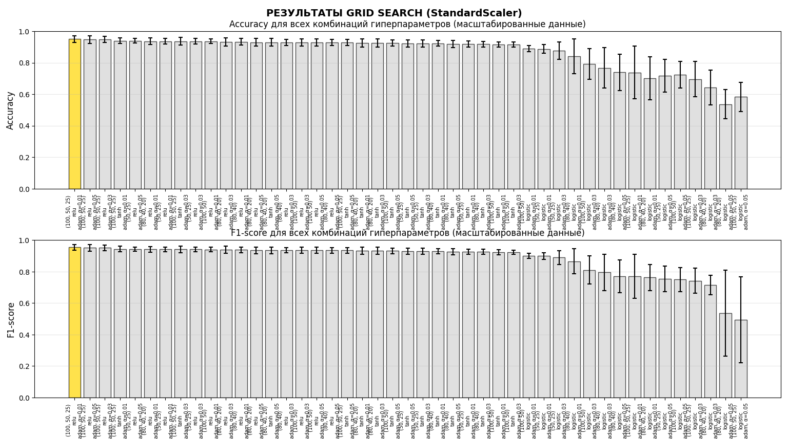

  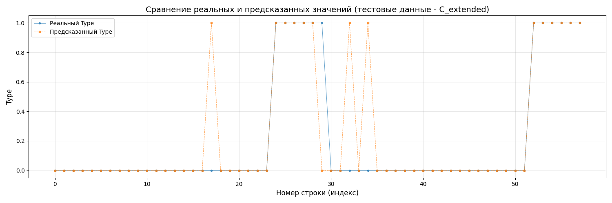

ADASYN отлично сбалансировал обучающую выборку, что подтверждается высокими и стабильными метриками кросс-валидации (F1-score > 95% с минимальным разбросом). Однако наблюдается существенное расхождение между качеством на кросс-валидации и на тестовой выборке (разница ~10% по F1-score), что может указывать на небольшое переобучение под сгенерированные синтетические примеры. Тем не менее, итоговый F1-score 84.62% является очень высоким показателем для данной задачи.

### SMOTE (Synthetic Minority Over-sampling Technique)

SMOTE — классический метод синтетической балансировки классов, который создает новые примеры для класса меньшинства путем интерполяции между существующими образцами.
Для каждого примера меньшинства находятся k ближайших соседей из того же класса, затем случайным образом выбирается один из соседей, и между исходным примером и соседом линейно интерполируется новый синтетический пример.
В отличие от ADASYN, SMOTE не учитывает сложность классификации и равномерно генерирует примеры по всему пространству класса меньшинства.

Применение SMOTE для балансировки классов дало следующие результаты:

| activation | alpha | hidden_layer_sizes | solver  |
|------------|-------|--------------------|---------|
| relu       | 0.01  | (50, 25)           | adam    |

Значения метрик Accuracy и F1-score представлены в таблице ниже.

| Метрика   | Фолд 1   | Фолд 2   | Фолд 3  | Фолд 4  | Фолд 5   | Среднее   | Разброс      | Тест    |
|-----------|----------|----------|---------|---------|----------|-----------|--------------|---------|
| Accuracy  | 0.9286   | 0.9286   | 0.9643  | 0.9643  | 0.9464   | 0.9464    | (+/- 0.0160) | 0.9138  |
| F1-score  | 0.9333   | 0.9333   | 0.9655  | 0.9655  | 0.9474   | 0.9490    | (+/- 0.0144) | 0.8000  |

  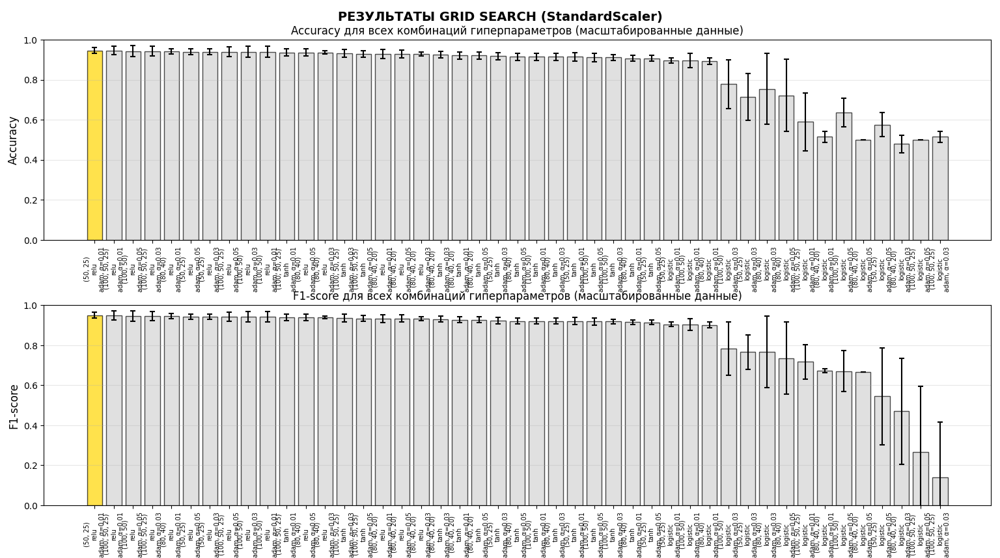

  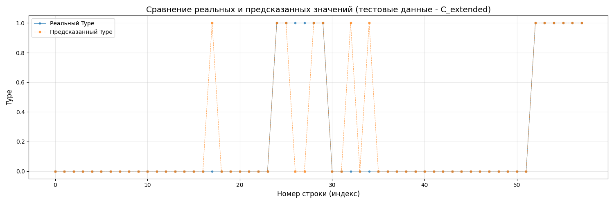

SMOTE обеспечил самую стабильную кросс-валидацию с минимальным разбросом метрик (1.44% для F1-score). Модель с архитектурой (50,25) оказалась наиболее простой среди сбалансированных, что снижает риск переобучения. Однако F1-score на тестовой выборке (80.00%) оказался ниже, чем у ADASYN (84.62%) и StandardScaler без балансировки (84.62%). Это может означать, что для данной задачи синтетическая генерация примеров меньшинства не дает дополнительного преимущества на реальных тестовых данных.

## Заключение

### Влияние предобработки данных:
Нормализация данных является критически важным этапом — улучшение F1-score с 57% до 84% (прирост на 27 процентных пунктов). StandardScaler показал себя лучше MinMaxScaler для данной задачи.

### Влияние сортировки:
Стратифицированное перемешивание данных улучшает обобщающую способность модели, но собственные реализации могут давать более гибкие результаты, чем встроенные механизмы.

### Влияние балансировки:
ADASYN и SMOTE существенно улучшают метрики кросс-валидации (до 95% F1-score), но не всегда дают прирост на реальных тестовых данных. Для данной задачи лучший результат на тестовой выборке показала модель с StandardScaler без дополнительной балансировки (F1-score 84.62%).

### Результаты на выборке C:

| Модель / Предобработка           | Accuracy   | F1-score   |
|----------------------------------|------------|------------|
| Базовая модель (MLP)             | 0.8448     | 0.5714     |
| Сортировка (Собственная функция) | 0.8448     | 0.6087     |
| Сортировка (StratifiedKFold)     | 0.8276     | 0.5000     |
| Нормализация (MinMaxScaler)      | 0.9138     | 0.8148     |
| Нормализация (StandardScaler)    | 0.9310     | 0.8462     |
| Балансировка (ADASYN)            | 0.9310     | 0.8462     |
| Балансировка (SMOTE)             | 0.9138     | 0.8000     |

### Лучшая конфигурация:
Наилучшая модель, показавшая F1-score 84.62% на тестовой выборке C, имеет следующие параметры: activation='relu', alpha=0.01, hidden_layer_sizes=(80,40,20), предобработка — StandardScaler. Эта конфигурация обеспечивает наилучший баланс между точностью, полнотой и устойчивостью к новым данным.

